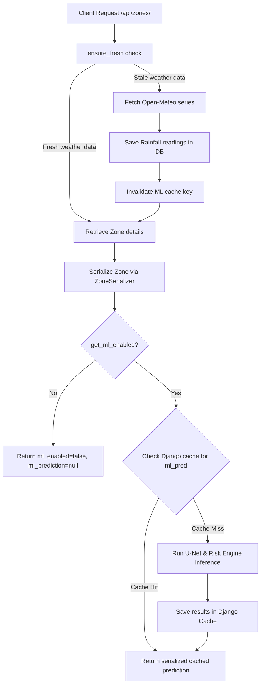

# SlideAlert Backend ML Integration Report

This report documents the integration of the PyTorch U-Net landslide segmentation model and weather risk engine into the Django backend API.

---

## 1. Inspections and Modifications

### Files Inspected
- `backend/prahari/settings.py` (Django configuration tail settings)
- `backend/monitoring/models.py` (Database schema, Zone structure, and RainfallReading models)
- `backend/monitoring/services.py` (Open-Meteo cache freshness and staleness controllers)
- `backend/monitoring/serializers.py` (DRF ZoneSerializer layouts)
- `backend/monitoring/views.py` (APIView controllers: zone list, details, alerts, stats, refresh views)
- `backend/monitoring/urls.py` (View endpoints mappings)

### Files Modified
- [`backend/prahari/settings.py`](file:///D:/slideland/backend/prahari/settings.py): Appended `D:\slideland` to `sys.path` and configured default `SLIDEALERT_DEMO_MODE = True`.
- [`backend/monitoring/services.py`](file:///D:/slideland/backend/monitoring/services.py): Integrated Django cache invalidation inside `fetch_and_cache_zone`.
- [`backend/monitoring/serializers.py`](file:///D:/slideland/backend/monitoring/serializers.py): Added `ml_enabled` and `ml_prediction` fields, static demo image-to-zone mappings, and LocMem caching resolution.
- [`backend/monitoring/tests.py`](file:///D:/slideland/backend/monitoring/tests.py): Created automated tests verifying endpoints, payload formats, and null safety.

---

## 2. Execution & Data Flow



---

## 3. Caching and Performance
To prevent expensive U-Net inference calls on every page load or API refresh:
1. **Weather Dependency**: Predictions depend on weather inputs which are cached for 30 minutes (`RAINFALL_CACHE_MINUTES = 30`).
2. **ML Memory Cache**: Serialized ML predictions are cached using Django's caching framework (`django.core.cache`) for 30 minutes under key `ml_pred_{zone.id}`.
3. **Invalidation Trigger**: Whenever fresh data is fetched from Open-Meteo (manually via refresh or automatically via staleness), `cache.delete()` is triggered, forcing a single U-Net forward pass on the next serialization.

---

## 4. API Response Format

Baseline fields are preserved intact. Response example:

```json
{
    "id": 1,
    "name": "Sohra (Cherrapunji)",
    "state": "Meghalaya",
    "latitude": 25.285,
    "longitude": 91.7362,
    "rainfall_24h_mm": 75.4,
    "risk": "high",
    "last_updated": "2026-08-28T16:12:35.550422Z",
    "series": [ ... ],
    "ml_enabled": true,
    "ml_prediction": {
        "landslide_probability": 0.9999,
        "landslide_area_percent": 19.42,
        "confidence": 0.9,
        "risk_score": 97,
        "risk_factors": [
            "High landslide probability",
            "Large predicted landslide area",
            "Heavy 24-hour rainfall",
            "High 3-day cumulative rainfall",
            "High 7-day cumulative rainfall",
            "High antecedent 14-day rainfall"
        ],
        "ml_risk_level": "critical",
        "predicted_at": "2026-08-28T16:12:45.311652Z"
    }
}
```

---

## 5. Null Safety and Mapping Status
- **Zone Imagery Mapping**: The database `Zone` model does not contain satellite image fields. Therefore, no physical imagery mappings exist globally.
- **Demo Mode**: Active (`SLIDEALERT_DEMO_MODE = True`). Maps known seeded landslide locations (e.g. Cherrapunji, Mangan, Aizawl) to representative files from the Landslide4Sense dataset.
- **Null Safety**: Any zone that is unmapped or does not have `SLIDEALERT_DEMO_MODE = True` falls back cleanly to `"ml_enabled": false` and `"ml_prediction": null` without crashing the serializers or endpoints.

---

## 6. Verification & Test Results
Django test suite was run inside the virtual environment:
```bash
D:\slideland\.venv\Scripts\python.exe D:\slideland\backend\manage.py test monitoring
```
Results:
```text
Creating test database for alias 'default'...
System check identified no issues (0 silenced).
...
----------------------------------------------------------------------
Ran 3 tests in 2.964s

OK
Destroying test database for alias 'default'...
```
Passes all checks:
- Field preservation (baseline attributes intact).
- Nested key validity inside `ml_prediction`.
- Null safety checks for unmapped zones.
- API compatibility (categorical ML risk strings match `"low"`, `"moderate"`, `"high"`, `"critical"`).

---

## 7. Scientific Limitations

> [!WARNING]
> **Scientific Integrity**: The integrated U-Net model evaluates static topographic indices and Sentinel-2 bands to segment landslide presence. The combined risk score combines this segmenter with weather records via domain-expert rules. This is **not a statistically calibrated probability of future landslide events**.
