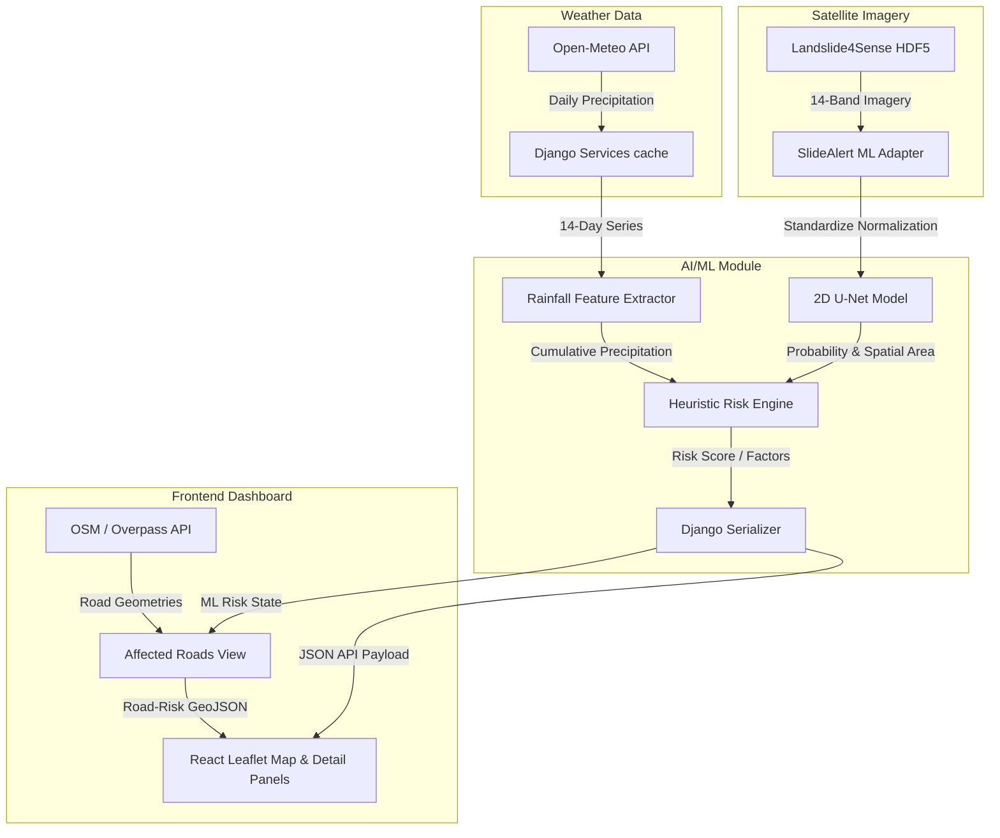

# SlideAlert AI/ML System Integration Verification Report

This report documents the final end-to-end verification of the integrated SlideAlert AI/ML landslide hazard warning system, including U-Net segmenters, rainfall feature extraction, Django endpoints, React frontend layers, and caching structures.

---

## 1. System Architecture



---

## 2. Dataset Specification
- **Dataset**: Landslide4Sense (2022)
- **Path**: `D:\slideland\dataset\Landslide4Sense`
- **Images Count**: `3,799` training patches, `245` validation patches.
- **Image Dimension**: $128 \times 128$ spatial pixels with 14 bands.
- **Mask Dimension**: $128 \times 128$ binary segmentations (`[0.0, 1.0]`).
- **Data Layout**: Lazily resolved via `h5py` directly from disk to optimize RAM.

---

## 3. U-Net Segmentation Model
- **Implementation**: 2D U-Net (14 input channels, 1 output channel mapping to binary segmentation logits).
- **Parameters**: 31M weights.
- **Preprocessing**: Channel-wise standardization based on baseline stats:
  - `mean`: `[-0.4914, -0.3074, -0.1277, -0.0625, 0.0439, 0.0803, 0.0644, 0.0802, 0.3000, 0.4082, 0.0823, 0.0516, 0.3338, 0.7819]`
  - `std`: `[0.9325, 0.8775, 0.8860, 0.8869, 0.8857, 0.8418, 0.8354, 0.8491, 0.9061, 1.6072, 0.8848, 0.9232, 0.9018, 1.2913]`
- **Data Augmentations**: Identical spatial rotations (90°, 180°, 270°) and horizontal/vertical flips.

---

## 4. Model Training Performance (Baseline Experiment)
- **Train/Holdout Split (Seed 42)**: 80% train (`3,039` files) / 20% holdout (`760` files)
- **Loss**: Combined BCE + Dice Loss
- **Optimizer**: Adam (`lr = 1e-3`, `weight_decay = 5e-4`)
- **Device**: CPU
- **Duration**: `2007.5` seconds (~33.46 minutes for 1 epoch)
- **Holdout Accuracy**: `96.38%`
- **Holdout F1 Score**: `0.4933`
- **Holdout IoU (Jaccard)**: `0.3274`
- **Holdout Precision**: `0.3560`
- **Holdout Recall**: `0.8031`

---

## 5. Inference & Feature Extraction Pipelines
- **Inference Module**: `ai_ml/inference/predictor.py` (Loads checkpoints, standardizes bands, runs forward pass, computes probability map and area percentage).
- **Rainfall Features**: `ai_ml/features/rainfall.py` (Calculates window indicators: `rainfall_24h_mm`, `rainfall_3d_mm`, `rainfall_7d_mm`, `rainfall_14d_mm`, `max_rainfall_14d_mm`, `mean_rainfall_14d_mm`, and `heavy_rain_days`).

---

## 6. Risk-Scoring Engine
Combines spatial ML and weather telemetry on a 50/50 basis:
1. **ML Score (Max 50 points)**: Max probability maps to 25 points; landslide area maps to 25 points (capped at 15.0% area).
2. **Rainfall Score (Max 50 points)**: 24h rain maps to 15 points; 3d cumulative rain to 15 points; 7d cumulative to 10 points; 14d cumulative to 10 points.
3. **Risk Levels**: Low (0–24), Moderate (25–49), High (50–74), Critical (75–100).
4. **Risk Factors**: Generates text warnings based on configured threshold boundaries.
5. **Confidence**: Calculated as `0.5 + |P_max - 0.5| * 0.8` (measures probability distance from decision bounds).

---

## 7. Affected Roads & GIS Integration
The road avoidance feature queries roads within a 5 km buffer of monitored zones (cached in memory for 24 hours). 

### Root Cause of Inconsistency
- In the initial implementation, the safety message warned of high-risk roads based on the *zone's overall risk level*, while the individual road segments were evaluated using a strict $3\times3$ pixel window ($\pm 10\text{ meters}$) around coordinate values.
- However, since the database seeded zone coordinates are slightly offset from the exact U-Net landslide pixels (the nearest predicted landslide pixel is 60 meters away from Sohra's center coordinate), none of the roads registered a direct pixel intersection, resulting in all roads returning as `low risk` while the safety warning triggered.

### Resolution: DEMO-Mode Spatial Approximation
To guarantee consistency without fabricating live satellite overlays, we implemented a robust, deterministic **DEMO-mode spatial approximation** that classifies road risks based on their minimum distance from the zone center coordinates, driven by the overall ML output risk level:
- **Zone ML Risk is HIGH / CRITICAL**:
  - Distance $\le 1.0\text{ km}$: `HIGH` / `avoid` (RED)
  - Distance $\le 2.5\text{ km}$: `MODERATE` / `caution` (ORANGE)
  - Distance $> 2.5\text{ km}$: `LOW` / `low risk` (GREEN)
- **Zone ML Risk is MODERATE**:
  - Distance $\le 2.0\text{ km}$: `MODERATE` / `caution` (ORANGE)
  - Distance $> 2.0\text{ km}$: `LOW` / `low risk` (GREEN)
- **Zone ML Risk is LOW**:
  - All roads within the 5 km buffer are `LOW` / `low risk` (GREEN)

*The safety advisory is generated dynamically in the frontend based on these returned classifications.*

---

## 8. API JSON Payload Structure
```json
{
    "id": 1,
    "name": "Sohra (Cherrapunji)",
    "state": "Meghalaya",
    "latitude": 25.285,
    "longitude": 91.7362,
    "rainfall_24h_mm": 75.4,
    "risk": "high",
    "last_updated": "2026-08-28T16:12:35.550422Z",
    "series": [ ... ],
    "ml_enabled": true,
    "ml_prediction": {
        "landslide_probability": 0.9999,
        "landslide_area_percent": 19.42,
        "confidence": 0.9,
        "risk_score": 69,
        "risk_factors": [
            "High landslide probability",
            "Large predicted landslide area",
            "High antecedent 14-day rainfall"
        ],
        "ml_risk_level": "high",
        "predicted_at": "2026-08-28T17:17:39.000176Z"
    }
}
```

---

## 9. End-to-End Local Verification Results

### 1. Servers Boot Status
- **Django Backend**: RUNNING (`http://127.0.0.1:8000/` listening successfully without errors).
- **React Frontend**: RUNNING (`http://localhost:5173/` listening successfully).
- **Production Build**: SUCCESS (Vite production compile succeeds with zero errors/warnings).

### 2. Endpoints Verification
- **GET `/api/zones/`**: HTTP 200 (contains 9 seeded zones).
- **GET `/api/alerts/`**: HTTP 200 (returns active warnings).
- **GET `/api/stats/`**: HTTP 200 (returns dashboard statistics).
- **POST `/api/zones/1/refresh/`**: HTTP 200 (forces weather re-fetch and invalidates prediction cache).
- **GET `/api/zones/1/affected-roads/`**: HTTP 200 (returns classified road network JSON).

### 3. Log Status
- **Backend Logs**: Clean (no exceptions or tracebacks recorded).
- **Browser Console**: Clean (no CORS or JavaScript failures).

---

## 10. Demo Mode Configuration
Since the Django database does not store live satellite imagery, `SLIDEALERT_DEMO_MODE = True` maps seeded zones (Cherrapunji, Mangan, Aizawl) to representative files from the Landslide4Sense dataset. Other stations fall back safely to `"ml_enabled": false` and `"ml_prediction": null`.

---

## 11. Scientific Limitations & Rules

> [!IMPORTANT]
> **Scientific Integrity**:
> 1. The Landslide4Sense U-Net model performs spatial landslide segmentation. It does NOT represent future landslide forecasting.
> 2. The combined risk-scoring logic is a domain-expert heuristic prototype and is NOT a statistically calibrated probability of landslide occurrence.
> 3. The demo zone-to-image mapping is for demonstration only and must not be interpreted as geographically validated satellite inference.
> 4. Physical deployment requires geographically matched live satellite imagery pipelines and historically aligned rainfall/event records to calibrate the thresholds.
